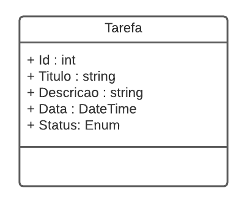

# Technical Report

## Project: Task API (To-Do List) with Entity Framework Core in C#

### Summary:
The objective of this project was to create a RESTful API to manage a To-Do List using C# and Entity Framework Core. The project included defining a data model to represent tasks, configuring a database context, and implementing CRUD (Create, Read, Update, Delete) operations to manipulate tasks.

### Steps Taken:

#### Project Structure:
- Created the basic project structure using the .NET Core SDK.
- Defined the data model to represent tasks (TaskItem) and task status (EnumTaskStatus).
- Configured the Entity Framework context (OrganizerContext) to interact with the database.

#### API Implementation:
- Created the task controller (TaskController) to handle CRUD operations.
- Implemented methods to fetch tasks by ID, title, date, and status, create, update, and delete tasks.
- Used Entity Framework Core to access and manipulate database data.

#### Entity Framework Core Configuration:
- Added necessary Entity Framework Core dependencies via NuGet.
- Configured the Entity Framework context to use an SQLite database.

#### Project Update:
- Fixed compatibility errors between dependency versions.
- Updated dependency versions to ensure compatibility with .NET 6.

### Commands to Restart the Application:

1. Restore dependencies:
```
   dotnet restore
```

2. Build the project:

```
dotnet build
```

3. Create the initial migration:

```
dotnet ef migrations add InitialCreate
```

4. Apply the migration to the database:

```
dotnet ef database update
```

## Application Features:

- **Creation of New Tasks**: Users can create new tasks by providing a title, description, date, and status.

- **Listing All Existing Tasks**: The application allows users to view a list of all existing tasks.

- **Searching for Tasks**: Users can search for tasks by their ID, title, date, and status, enabling efficient retrieval of specific tasks.

- **Updating Task Information**: Existing task information can be updated, providing flexibility for users to modify task details as needed.

- **Deleting Tasks**: Users can delete existing tasks, removing them from the system when they are no longer needed.

## Conclusion:

The project was successfully completed, delivering a fully functional API for managing a To-Do List. The integration with Entity Framework Core ensures efficient handling of database operations, contributing to the scalability and robustness of the application.


# DIO - Trilha .NET - API e Entity Framework
www.dio.me

## Desafio de projeto
Para este desafio, você precisará usar seus conhecimentos adquiridos no módulo de API e Entity Framework, da trilha .NET da DIO.

## Contexto
Você precisa construir um sistema gerenciador de tarefas, onde você poderá cadastrar uma lista de tarefas que permitirá organizar melhor a sua rotina.

Essa lista de tarefas precisa ter um CRUD, ou seja, deverá permitir a você obter os registros, criar, salvar e deletar esses registros.

A sua aplicação deverá ser do tipo Web API ou MVC, fique a vontade para implementar a solução que achar mais adequado.

A sua classe principal, a classe de tarefa, deve ser a seguinte:



Não se esqueça de gerar a sua migration para atualização no banco de dados.

## Métodos esperados
É esperado que você crie o seus métodos conforme a seguir:


**Swagger**


**Endpoints**


| Verbo  | Endpoint                | Parâmetro | Body          |
|--------|-------------------------|-----------|---------------|
| GET    | /Tarefa/{id}            | id        | N/A           |
| PUT    | /Tarefa/{id}            | id        | Schema Tarefa |
| DELETE | /Tarefa/{id}            | id        | N/A           |
| GET    | /Tarefa/ObterTodos      | N/A       | N/A           |
| GET    | /Tarefa/ObterPorTitulo  | titulo    | N/A           |
| GET    | /Tarefa/ObterPorData    | data      | N/A           |
| GET    | /Tarefa/ObterPorStatus  | status    | N/A           |
| POST   | /Tarefa                 | N/A       | Schema Tarefa |

Esse é o schema (model) de Tarefa, utilizado para passar para os métodos que exigirem

```json
{
  "id": 0,
  "titulo": "string",
  "descricao": "string",
  "data": "2022-06-08T01:31:07.056Z",
  "status": "Pendente"
}
```


## Solução
O código está pela metade, e você deverá dar continuidade obedecendo as regras descritas acima, para que no final, tenhamos um programa funcional. Procure pela palavra comentada "TODO" no código, em seguida, implemente conforme as regras acima.
